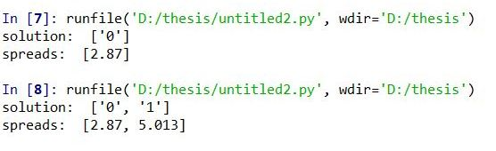

# Kempe-IM-IC
# Explanation of 'Sample-Kempe-IM'
# Input : 

Directed Graph, G(V,E) :

# Output:

Max-Seed-Set-Size=2

when k or num_seed_nodes =1, solution is 0 as 0 is the most influential.

when k or num_seed_nodes =2, solution is 0 & 1 as 0 & 1 is the most influential pair, together they make a 5.013 influence which is greater than any other pair you choose.
